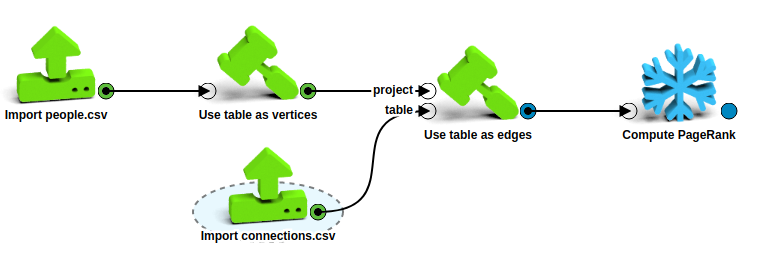
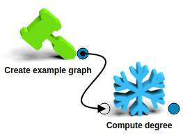
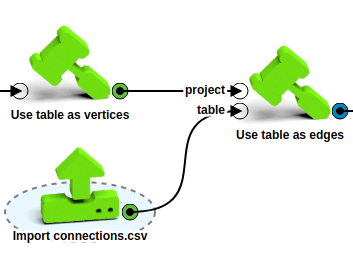
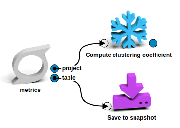
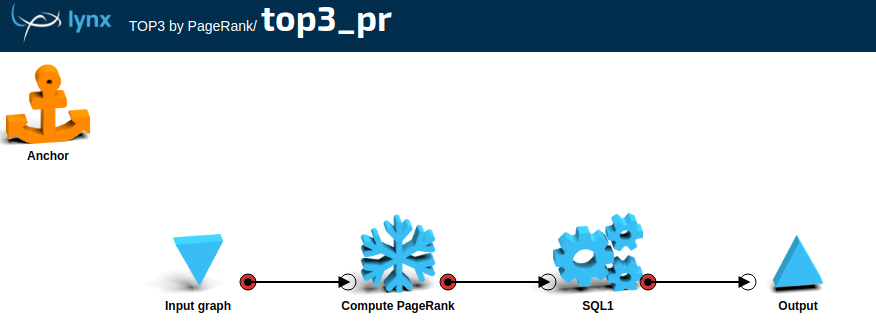
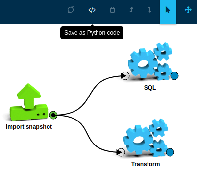
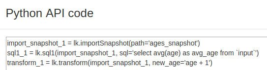

<!-- $theme: gaia -->
<!-- $size: 16:9 -->

Python TEDx: LynxKite 2 API
===

#### 2018-06-01, Peter Erben

---
<!-- *template: gaia -->
# Overview :eyes:

---
## The LynxKite automation framework


---
<!-- *template: gaia -->
# API design goals :sunny:

---
## API design goals | 1.

_What can be done on the LK UI is also possible in the Python API._



```python
people      = lk.importCSV(filename=...).useTableAsVertices()
connections = lk.importCSV(filename=...)
result      = lk.useTableAsEdges(people, connections,
                 attr='name', src='src', dst='dst').computePageRank()

```

---
## API design goals | 2.

_Pipeline pieces are reusable, composition happens in Python, using "functions"._

```python
@lk.workspace()
def clean_cdr(source_cdr):
  ...

@lk.workspace()
def find_scv_edges(clean_cdr):
  ...

@lk.workspace()
def scv(cdr):
  return dict(scv=find_scv_edges(clean_cdr(cdr)))

```
---
## API design goals | 3.

_Workflows built with the API are easy to automate._

```python
# Defining automation configuration
wss = lynx.automation.WorkspaceSequence(
        ws=scv,
        schedule='0 6 * * *',
        start_date=datetime(2018, 6, 1),
        lk_root='tedx_automation_example',
        # input recipes have a build_boxes(date) method
        input_recipes=[CSVRecipe('/location/of/source/files')])

# Creating DAG object for Airflow
tedx_dag = wss.to_airflow_DAG('tedx_dag')
```
---
## API design goals | 4.

_The API is "lazy", only calls LynxKite, when necesseray. Most of the workflow building happens on the Python side._

```python
lk = lynx.kite.LynxKite()                                   # No backend call
g  = lk.createVertices(size=10).createRandomEdges(degree=5) # No backend call
pr = g.computePageRank()                                    # No backend call
t  = pr.sql('select page_rank from vertices')               # No backend call
e  = t.exportToParquet(path=...)                            # No backend call
e.trigger()         # The workspace is sent to LK, computations are triggered

```

---
## API design goals | 5.

_It's easy to combine LK and non-LK pipelines._

```python
# This file is in the Airflow dags folder.

...
# LK pipeline
scv_dag = scv.to_airflow_DAG('SCV')
...
# non-LK Python pipeline
etl_dag = ...

```

The dependencies between the different dags can be handled by Airflow _sensors_.

---

<!-- *template: gaia -->
# Working with LK using Python :wrench:
### (in notebooks or command line)

---
## Boxes and states


---

## Boxes and states

- LK2 workspace: connected _boxes_
- boxes can have input and output plugs , which have names, like "graph", "table", "input", ...
- the outputs of boxes called _states_

---

## Boxes and states

```python
# define a box (camelCase)
lk.createExampleGraph()
```

```python
# access an output state of a box (in this case it's a project)
lk.createExampleGraph()['project']
```

```python
# syntactic sugar, for single output boxes
eg = lk.createExampleGraph()

# eg is both a box and a state, so instead of
eg['project']
# we can just write
eg
```


----
## Boxes and states | single input

- to connect an ouput plug to an input plug, we can use the output state as a positional argument


```python
eg = lk.createExampleGraph()
result = lk.computeDegree(eg)
```

---
## Boxes and states | single input - chaining

- single input and single output boxes can also be connected with _chaining_


```python
lk.createExampleGraph().computeDegree()
```
---
## Boxes and states | multiple inputs

- boxes with more than one input: we can use positional arguments


```python
people      = lk.importCSV(filename=...).useTableAsVertices()
connections = lk.importCSV(filename=...)
result      = lk.useTableAsEdges(people, connections,...)
```
:warning: <small>The order of the arguments should match the order of the input plugs.</small>

---
## Boxes and states | multiple outputs

- boxes with more than one output: use indexing to access outputs


```python
metrics = lk.metrics() # It's a custom box, not a built-in operation
clustering_coeff = metrics['project'].computeClusteringCoeficcient()
snapshot = metrics['table'].saveToSnapshot(path=...)
```


---
## Box or state? :confused:

_Single output atomic boxes are also states._ (Syntactic sugar)


We connect the output plug of the "Create vertices" **box** to the
input plug of the "Create random edges" **box**:
```python
lk.createVertices(size=10).createRandomEdges()
```

We access the output **state** of the "Create vertices" box:
```python
lk.createVertices(size=10).get_project()

# This is a shorthand for:
lk.createVertices(size=10)['project'].get_project()
```

---

## Box inputs and box parameters

```python
lk.useTableAsEdges(graph, edge_table, attr='name', src='src', dst='dst')
```

- a box can have multiple inputs and parameters
- we have to pass the inputs as positional arguments,
- and then the parameters as keyword arguments

In the example `graph` and `edge_table` are the input states, `attr`, `src` and `dst` are parameters of the "Use table as graph" LynxKite operation.

---
## A mistake, which is easy to make


- :x: BAD: `lk.importSnapshot('path/to/folder')` <br>this is a **positional argument**, _interpereted as an input_, so we get an error like _Entry '' is not a snapshot_


- :heavy_check_mark: GOOD: `lk.importSnapshot(path = 'path/to/folder')`<br> this **keyword argument** is _interpreted as an operation parameter_


---
## Box inputs and box parameters

So the general format, again:

```python
lk.boxName(input1, input2, ..., param1=value1, param2=value2,...)
```
<br><br><br>

:warning: There is one exception: the `sql` shorthand notation. (Details later.)


---
## Box outputs

---
## Box outputs | output kinds

Possible _kinds_ of ouput states:
- **project** <br>_also known as graph_ <br>(almost full API support)
- **table**  <br>(full API support)
- **visualization** <br>(basic API support)


---

## Box outputs | projects
- access project state with `get_project`, `get_scalar`

See examples in `Introduction.ipynb`

---

## Box outputs | tables

- access table state with `get_table_data`

```python
table = lk.importParquet(...).get_table_data(limit=2)

print('Schema: ', [(field.name, field.dataType) for field in table.header])
print('Rows: ', [[field.string for field in row] for row in table.data])
```

Example output:

```
Schema:  [('name', 'String'), ('age', 'Double'), ('income', 'Double')]
Rows:  [['Adam', '20.3', '1000'], ['Eve', '18.2', 'null']]
```

---

## Box outputs | tables as pandas dataframes
- tables can be converted to pandas dataframes with `df`

```python
csv_path = lk.upload('name,score\nAdam,12\nBob,4\nEve,16\nIsolated Joe,3')
df = lk.importCSV(filename=csv_path, infer='yes').df()

#            name  score
# 0          Adam   12.0
# 1           Bob    4.0
# 2           Eve   16.0
# 3  Isolated Joe    3.0

df['score'].mean()

# 8.75
```

---
## Import and export

---
## Import and export | uploading files


```python
csv_path = lk.upload(open('/home/user/cdr.csv'))
# csv_path will contain something like this:
# 'UPLOAD$/6566239f05332d8bd883265271dbfd2a.remote-api-upload'

cdr = lk.importCSVNow(path = csv_path, infer='yes')
result = cdr.sql('select count(*) as cnt from input')
```

---
## Import and export | import operations

Import boxes are special, because of the "run import" button

To express, that we want to "press that button now", we can use the name `importXYZNow`. (Instead of just `importXYZ`.)


```python
csv_path = lk.upload(open('/home/user/cdr.csv'))

cdr = lk.importCSVNow(path = csv_path, infer='yes')

result = cdr.sql('select count(*) as cnt from input')
```

Import operations at the moment: `importCSVNow`, `importJDBCNow`, `importJSONNow`, `importORCNow`, `importParquetNow`, `importFromHiveNow`

---
## Import and export | export boxes

Export boxes are triggerable.

```python
table.exportToParquet(path=export_path).trigger()
```

Available export boxes at the moment: `exportToCSV`, `exportToJSON`, `exportToParquet`, `exportToJDBC`, `exportToORC`

To make executing exports more convenient, similarly to input boxes we make available a "Now" syntax. (`exportToCSVNow`, `exportToJSONNow`, `exportToParquetNow`, `exportToJDBCNow`, `exportToORCNow`)

```python
# Using export operation. Triggered automatically.
table.exportToParquetNow(path=export_path)
```


---
## Snapshots

---
## Snapshots

- the output of any box can be saved as a snapshot
- snapshot locations are specifed as LK paths
- LK paths are only meaningful in the LK directory tree
- a saved snapshot can be loaded to another workflow to use as input

---
## Snapshots | saving and loading

To save and load snapshots, we can use: `saveToSnapshot` and `importSnapshot`

```python
# Somewhere
graph.saveToSnapshot('path/to/folder').trigger()

# Somewhere else
lk.importSnapshot(path='path/to/folder').computePageRank()
...
```

:warning: Absolute LK paths has to be written without a leading slash.

:x: BAD: `/path/to/folder`
:heavy_check_mark: GOOD: `path/to/folder`

---
## LK directory system
- absolute LK paths has to be written without a leading slash
- we store two type of _entries_ in LK directories
    - workspaces
    - snapshots
- entries in a LK directory can be queried with `lk.list_dir(path)`
- entries can be deleted with `lk.remove_name(path)`


---
## Forcing computation

---
## Forcing computation | lazy API

As we mantioned earlier, the API is "lazy", it only calls the LynxKite backend when it is necesseray or when it is explicitly asked to do so.

Possible ways to force LK computation:

- accessing scalars or table data with `get_scalar` and `get_table_data`
- using `exportXYZ.trigger`, `saveToSnapshot.trigger` or `computeInputs.trigger`
- calling `compute` on a project or table state
- triggering a box in a saved workspace
- using `importXYZNow` methods

---
## Forcing computation | import and export

```python
lk.importCSVNow(filename=...)
lk.importParquetNow(filename=...)

state.exportCSVNow(...)
state.exportParquetNow(...)
```

---
## Forcing computation | triggerable boxes

```python
table = ...
table.exportToParquet(path=...).trigger()
...
table.saveToSnapshot(path=...).trigger()

```

---
## Forcing computation | compute

```python
project = ...
project.compute()
...
table = ...
table.compute()

# Visualization support: coming soon
```


---
## SQL

---
## SQL | queries on projects and tables

We can run SQL queries on projects and tables.

```python
table = lk.importCSVNow(filename=lk.upload('a,b\n1,2\n3,4\n5,6'))
table.sql1(sql = 'select a+b as c from input' ).df()
#      c
# 0  3.0
# 1  7.0
# 2 11.0

graph = ...
graph.sql1(sql = 'select * from vertices')
```

There are 10 different SQL box in LK: `sql1`, `sql2`, ..., `sql10`.
`sqlx` has exactly `x` inputs.

---
## SQL | name of the input tables


|input kind|number of inputs|name of tables
| --- | :---: | --- |
|table |1 |`input` |
|table | >1| `one`, `two`, `three`, ... |
|project| 1| `vertices`, `edges`, `edge_attributes`, `scalars`, `segmentation.vertices`, ...|
|project | >1| `one.vertices`, `two.edges`, ... |

---
## SQL | shorthand notation

```python
table1 = ...
table2 = ....
result = lk.sql2(table1, table2, sql = 'select ... from one, two where ...')
```
We had to write `sql` twice and had to specify the numer of inputs.

There is a simpler way:
```python
result = lk.sql('select ... from one, two where ...', table1, table2)
```


:warning: This syntax is different from the rest of the API. The first positional argument is not an input, but the SQL query string.


---
## SQL | shorthand notation

```python
# SQL with one input table
table.sql('select ... from input where ...')

# SQL with multiple input tables
lk.sql('select .. from one, two, three where ...', table1, table2, table3)

# SQL with named input tables
lk.sql('select .. from t1, t2, t3 where ...', t1=table1, t2=table2, t3=table3)
```


---
## LK workspaces


---
## LK workspaces | creating a workspace


- the API just adds boxes in "vacuum" and connected boxes are implicitly in a "must be on the same workspace" relation
- to actually create a  `Workspace` object, we can use the `Workspace` constructor
```python
ws = lynx.kite.Workspace('name of the workspace', list_of_terminal_boxes)
```

---
## LK workspaces | creating a workspace

```python
# Complete example
eg = lk.createExampleGraph()
pr = eg.computePageRank().sql('select name, page_rank from vertices')
names_path = lk.upload('name\nEve\nBob')
names = lk.importCSV(filename=names_path)
result1 = lk.sql('select * from one inner join two on one.name = two.name',
                 pr, names)
result2 = eg.filterByAttributes(filterva_gender='Female')

# result1 and result2 are the terminal boxes (they are also states)
ws = lynx.kite.Workspace('Save example', [result1, result2])
```

The `Workspace` constructor collects all the boxes, needed for `result1` and `result2`, and creates the `Workspace` object from them.


---

## LK workspaces | saving a workspace

```python
# Complete example (continued)
...
ws = lynx.kite.Workspace('Save example', [result1, result2])
ws.save('Example folder)
```

The saved workspace can be used on the UI, or to trigger boxes of the workspace.

---
## LK workspaces | saved workspace on the UI:


---
## LK workspaces | custom boxes

- in LK you can use one workspace from another via so called custom boxes
- a custom box is a special box which refers to another workspace
- the referred workspace may have `input` and `output` boxes
- this way the referred workspace can be used with different inputs (via connecting something to the input plugs of the custom box), and its outputs can be used (via output plugs of the custom box)
- in the API workspaces are callable
- when we call a workspace, we create a custom box which refers to the workspace

---
## LK workspaces | custom boxes

```python
inp = lk.input(name='graph')
pr = inp.computePageRank()
sql = pr.sql('select * from vertices order by page_rank desc limit 3')
cb = sql.output(name='top3')
top3_pr = lynx.kite.Workspace('top3', terminal_boxes=[cb], input_boxes=[inp])

eg = lk.createExampleGraph()
random_graph = lk.createVertices(size=20).createRandomEdges()

top3_pr(eg).df()
top3_pr(random_graph).df()
```

---
## LK workspaces | workspace decorator

To make it easier to define workspaces with input and output boxes, we have the `@lk.workspace()` decorator.

If you use the decorator then input and output boxes are added automatically and you can use the nice python function declaration syntax.


---
## LK workspaces | workspace decorator

```python
# a workspace which outputs a table
# with the top 3 vertices of a graph by PagerRank

@lk.workspace()
def top3_pr(graph):
  result = graph.computePageRank().sql(
                 'select * from vertices order by page_rank desc limit 3')
  return dict(top3=result)

eg = lk.createExampleGraph()
random_graph = lk.createVertices(size=20).createRandomEdges()

eg_top3 = top3_pr(eg)
random_graph_top3 = top3_pr(random_graph)

```

---
## LK workspaces | @workspace on the UI

```python
@lk.workspace()
def top3_pr(graph):
  result = graph.computePageRank().sql('select * from vertices... limit 3')
  return dict(top3=result)
top3_pr.save('TOP3 by PageRank')
```



---
<!-- *template: gaia -->
# What we've learnt today :ballot_box_with_check:


---
- how to build LK2 workflows
- how to import data to LK and export data from LK
- how to access LK directory entries
- how to work with tables (pandas, SQL)
- how to create workspaces and custom boxes

---
<!-- *template: gaia -->
# Additional information :bookmark_tabs:


---
## Notes

- Documentation notebooks (in github repository)
  - Introduction.ipynb
  - Automation.ipynb (work in progress)

---
## Python code generation on UI (experimental)





---
<!-- *template: gaia -->
# Questions :question:

---

###### Created with [Markdown presentation writer](https://yhatt.github.io/marp/)
